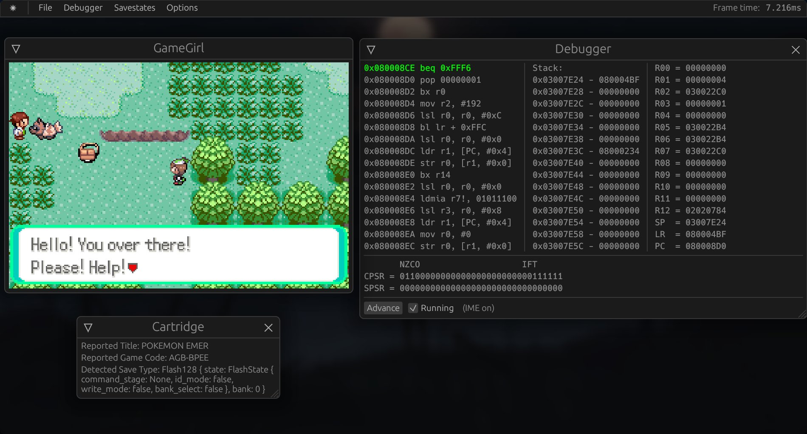

# GameGirl
A Gameboy (Color/Advance) emulator written in Rust, whose GG/GGC core is a rewrite of 
[gamelin](https://git.angm.xyz/ellie/gamelin).  
[Try it in your browser!](https://gamegirl.angm.xyz)


## Screenshots
##### Playing Pokemon Emerald

##### Playing Pokemon Crystal Clear

##### Pokemon Pinball with running debugger and memory viewer

##### TLoZ: Oracle of Ages with some visual debugging tools open


## Status
The DMG/CGB emulator is in a good and usable state. Both DMG and CGB emulation is complete and quite accurate, 
enough to make most commercial games run perfectly.  
AGB support is early with some things still missing; still working on the PPU and
making the emulation overall more accurate and fast. Most games are playable, but with
graphical glitches.

### Features
- Complete DMG/CGB implementation, including running DMG games on CGB
- Colour correction for CGB
- Highly configurable, including input
- Savegame support in common `.sav` format (Basic RTC support)
- Support for creating and loading save states with "undo last load" function
- Fast forwarding hotkeys, both toggle and hold
- Rewinding support with little memory use (~1MB per second of rewinding at 60fps)
- Debugger with:
    - Line-by-line advance
    - PC and write breakpoints
    - Memory, register and stack view
    - Cartridge Info Viewer
    - Visual debugging tools: VRAM and map viewers
- Automated running of a bunch of different tests

### System emulation
- [ ] DMG/CGB
  - [x] Most commercial games running glitch-free 
  - [ ] Full SM83 CPU
    - [x] Full instruction set implemented and passing tests
    - [ ] M-cycle accuracy
    - [ ] Highly accurate interrupts (Pinball Fantasy)
  - [ ] PPU
    - [x] Passing visual tests
    - [ ] OAM bug
    - [ ] Variable OAM scan timings
  - [ ] Timer
    - [x] Passing blargg tests
    - [ ] Passing mooneye tests
  - [x] OAM DMA
  - [x] APU
  - [x] Cartridge mappers
    - [x] MBC1
    - [x] MBC2
    - [x] MBC3
    - [x] MBC5
  - [x] CGB features
    - [x] 2x Speed
    - [x] HDMA
    - [x] Banking
    - [x] PPU: DMG compatibility mode

- [ ] AGB
  - [ ] Most commercial games running glitch-free
  - [x] Full ARM7DTMI CPU
    - [x] Cycle accuracy
    - [x] Accurate interrupts
    - [x] Accurate waitstates
  - [ ] Open bus behavior
  - [ ] PPU
    - [ ] Passing visual tests 
    - [x] Text mode Backgrounds
    - [x] Bitmap mode Backgrounds
    - [x] Objects
    - [x] Priority
    - [ ] Blending
    - [ ] Affine BGs/objects
    - [ ] Windows
  - [x] APU
    - [x] CGB sound channels
    - [x] DMA sound channels
    - [x] All Volume control registers
  - [ ] DMAs
    - [x] General transfers
    - [x] Fine register behavior (Not replacing address if invalid, etc)
    - [x] APU FIFO transfers
    - [x] GamePak EEPROM transfers
    - [ ] DMA3 Video Capture
  - [x] Timers
    - [x] Scheduled timers
    - [x] Cascading timers
    - [x] APU FIFO ticking
  - [x] Cartridge save types
    - [x] EEPROM
    - [x] SRAM
    - [x] Flash

### Planned Features
- [ ] Controller support
- [ ] Save export on Web/WASM
- [ ] Fix savestates/rewinding on WASM
- [ ] Proper GBA support, someday?


## Goals
The main goals of this emulator is to create a nice-to-use emulator with many comfort features that should be able
to run well in the browser. Accuracy is also a goal however, with the only exception being details
that noticeably hurt performance to implement.

### Missing console features
- Some MBC3 controllers have a built-in RTC for keeping track of time; gamegirl implements it,
  but in a very simple format incompatible with other emulators that has a high chance of
  not working with most games (it was tested with Pokemon Crystal and successfully kept time
  after turning the game off overnight - needs more testing).
  It is the same format used by Gamelin.


## Build
``` bash
cargo build --release
# Release binary now in target/release/gamegirl_bin.
```


## Testing
Test ROMs can be run automatically:
```bash
# Run GGA test roms
cargo run -p tests --release

# Also run GG test roms
cargo run -p tests --release -- --gg
```

### GG/GGC
- [x] Blargg (except `oam_bug`)
- [ ] Mooneye
  - [ ] `acceptance`: 30/71
  - [x] `emulator-only`: 27/28 (MBC1M, not supported)
- [x] Acid2
  - [x] dmg-acid2
  - [x] dmg-acid2 in CGB mode
  - [x] cgb-acid2

### GGA
- [ ] mgba's suite
  - Memory: 1489/1552
    - ROM load: DMA1-3 fail
    - ROM OOB load: 32, DMA1-3, swi fail
    - SRAM load: DMA1-3 fail
- [ ] jsmolka's gba-tests
  - [x] `arm`
  - [x] `memory`
  - [x] `thumb`
  - [x] `save` (All of them)
  - [x] `ppu` (All of them)
  - [x] `nes`
  - [x] `bios`
  - [ ] `unsafe` (Fails at 002, OOB ROM reads)
- [ ] destoer's gba_tests
  - [x] `cond_invalid`
  - [ ] `dma_priority` (Causes stack overflow even...)
  - [x] `hello_world`
  - [x] `if_ack`
  - Unsure of how to interpret results of the rest...
- [x] ladystarbreeze's GBA test collection
- [x] [FuzzARM](https://github.com/DenSinH/FuzzARM), all 5 precompiled tests
- [x] ARMWrestler

## Thanks To
### General
- [emilk, for creating egui](https://github.com/emilk/egui)
- The wider Rust community, for its awesome ecosystem
- You, for reading this :)

### GG/GGC
- [Imran Nazar, for their series of blog posts on GB emulation](http://imrannazar.com/GameBoy-Emulation-in-JavaScript:-The-CPU)
- [Michael Steil, for The Ultimate Game Boy Talk](https://media.ccc.de/v/33c3-8029-the_ultimate_game_boy_talk)
- [kotcrab, for creating the xgbc emulator I often used to confirm/understand fine behavior](https://github.com/kotcrab/xgbc)
- [Amjad50, for their emulator mizu, which I abridged the sound implementation from](https://github.com/Amjad50/mizu/)
- [Megan Sullivan, for her list of GB opcodes](https://meganesulli.com/blog/game-boy-opcodes)
- [gbdev.io for a list of useful resources and the Pan Docs](https://gbdev.io)
- blargg, Gekkio and mattcurie for their test ROMs and retrio for hosting blargg's ROMs

### GGA
- [endrift, for mGBA, it's test suite and blog,](https://github.com/endrift) which was my inspiration for doing GGA emulation
- [GBATEK, as a technical reference](https://problemkaputt.de/gbatek.htm)
- [mj-hd, for rgba, which I used to properly understand ARM7 emulation details](https://github.com/mj-hd/rgba/)
- [jsmolka, for their testing ROMs](https://github.com/jsmolka/gba-tests)
- [DenSinH, for FuzzARM and GBAC-](https://github.com/DenSinH)
- [ladystarbreeze, for their testing ROMs](https://github.com/ladystarbreeze/GBA-Test-Collection)
- [destoer, for their testing ROMs](https://github.com/destoer/gba_tests)