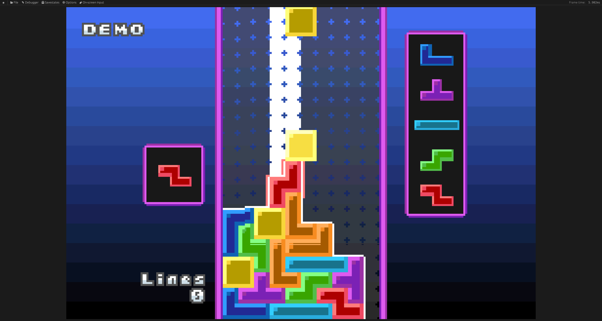
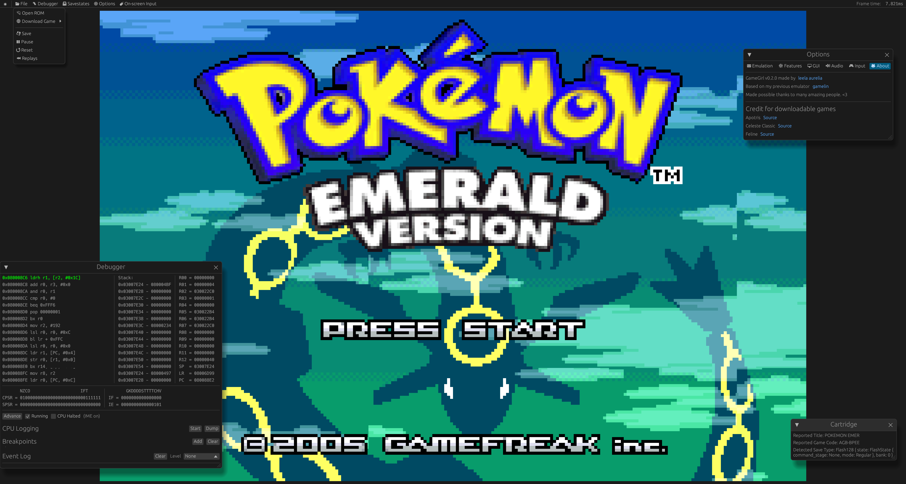
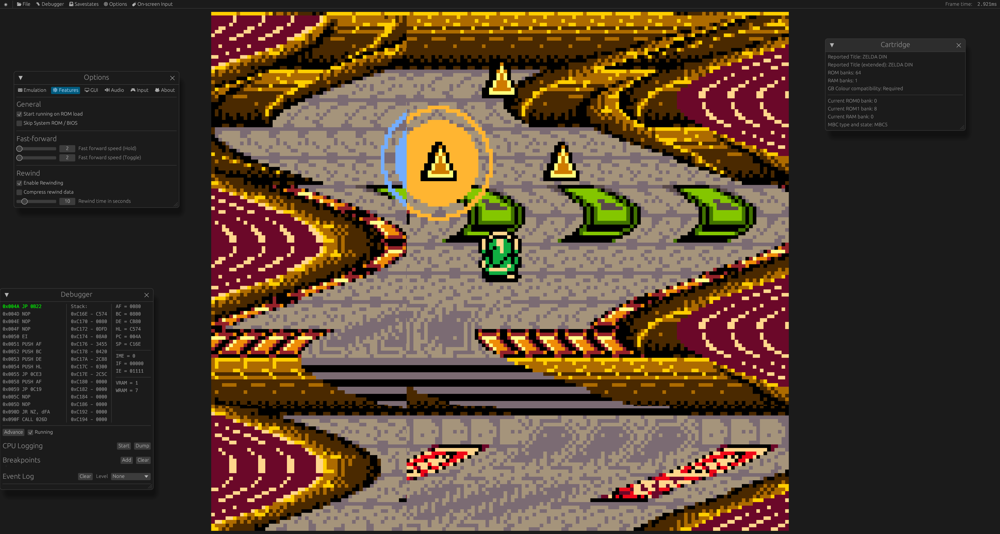

# GameGirl
A Gameboy (Color/Advance) emulator and debugger written in Rust, whose GG/GGC core is a rewrite of
[gamelin](https://git.elia.garden/ellie/gamelin).
NDS support is in the works!

[Try it in your browser!](https://gamegirl.elia.garden)


## Screenshots
##### Playing Apotris

##### Playing Pokemon Emerald with debugger

##### TLoZ: Oracle of Ages with running debugger



## Status
The AGB (GameBoy Advance) emulator is in a good and usable state.
Automated testing of most commercial games shows that most of them are playable,
and work without any major glitches.
The core is well optimized and ready to be used.

The CGB/DMG (GameBoy [Color]) core is fairly accurate, but still has some bugs
left to be worked out. Many games run well.

The NDS core is still very early and unable to boot anything at this time.

### Features
#### General
- Highly configurable, including input (controller support!)
- Savegame support in common `.sav` format (Basic RTC support)
- Support for creating and loading save states with "undo last load" function
- Fast forwarding (toggle and hold), live rewinding support
- Debugger with:
    - Line-by-line advance
    - PC and write breakpoints
    - Memory, register and stack view
    - Cartridge Info Viewer
    - Visual debugging tools: VRAM and map viewers
- Automated running of a bunch of different tests and games
- Replay support for playback of previous inputs
- Able to run in the browser!

#### GG(C)
- Accurate scheduler-based emulation of the system
- Complete and M-cycle cycle-accurate DMG/CGB implementation, including running DMG games on CGB
- Colour correction for CGB

#### GGA
- Accurate scheduler-based emulation of the system
- A cached interpreter and threaded PPU
- Remote debugger support (GDB server)
- Support for playing ELF files
- Waitloop detection

### System emulation
- [ ] DMG/CGB
  - [x] Most commercial games running glitch-free
  - [ ] Full SM83 CPU
    - [ ] Highly accurate interrupts (Pinball Fantasy)
  - [ ] PPU
    - [x] Passing visual tests
    - [ ] OAM bug
    - [ ] Variable OAM scan timings
  - [ ] Timer
    - [x] Passing blargg tests
    - [ ] Passing mooneye tests
  - [x] OAM DMA
  - [x] APU
  - [x] Cartridge mappers
    - [x] MBC1
    - [x] MBC2
    - [x] MBC3
    - [x] MBC5
  - [x] CGB

- [ ] AGB
  - [x] Most commercial games running glitch-free
  - [x] Full ARM7DTMI CPU
  - [x] Open bus behavior
  - [ ] PPU
    - [ ] Passing precise visual tests
    - [x] Everything else
  - [x] APU
  - [x] DMAs
  - [x] Timers
  - [x] Cartridge save types
  - [ ] RTC

- [ ] NTR
  - [ ] ARM7 and ARM9 CPUs
    - [x] ARM7
    - [x] ARM9
    - [ ] ARM9 CP15
  - [ ] FIFO
  - [ ] PPU
    - [ ] Tile PPU
    - [ ] 3D Engine
  - [x] Timers
  - [x] DMA
  - [ ] Cartridge support
  - [ ] Memory control
  - [ ] Many other things

### Planned Features
- [ ] Save export on Web/WASM


## Goals
The main goals of this emulator is to create a nice-to-use emulator with many comfort features that should be able
to run well in the browser. Accuracy is also a goal however, with the only exception being details
that noticeably hurt performance to implement.

### Missing console features
- GG: Some MBC3 controllers have a built-in RTC for keeping track of time; gamegirl implements it,
  but in a very simple format incompatible with other emulators that has a high chance of
  not working with most games (it was tested with Pokemon Crystal and successfully kept time
  after turning the game off overnight - needs more testing).
  It is the same format used by Gamelin.


## Build
``` bash
cargo build --release
# Release binary now in target/release/gamegirl_bin.
```

You will probably get an error about missing firmware files for PSX and NDS -
if you do not plan on using those cores, simply supply empty files.


## Testing
### GG/GGC
- [x] All Blargg tests (`oam_bug` untested)
- [ ] Mooneye
  - [ ] `acceptance`: 41/70 (Some tests for DMG/MGB/SGB-specific behavior disabled)
  - [x] `emulator-only`: 27/28 (MBC1M, not supported)
- [x] Acid2
  - [x] dmg-acid2
  - [x] dmg-acid2 in CGB mode
  - [x] cgb-acid2

### GGA
- [ ] mgba's suite
  - [x] Memory: 1552/1552
  - [x] I/O read: 130/130
  - [ ] Timing: 1395/2020
  - [ ] Timer count-up: Freezes...
  - [x] Timer IRQ: 90/90
  - [x] Shifter: 140/140
  - [x] Carry: 93/93
  - [x] Multiply long: 52/72 (cosidered complete; carry is still not researched in general)
  - [x] BIOS math: 625/625
  - [ ] DMA tests: 1248/1256
    - "0 Imm H/W R+0x10/+{IW,EW}RAM" tests fail (DMA0 with ROM?)
  - [ ] Misc. edge case tests: 7/10
  - [ ] Video Tests
    - [x] Basic Mode 3
    - [x] Basic Mode 4
    - [x] Degenerate OBJ transforms
    - [ ] Layer toggle
    - [ ] OAM Update Delay
- [ ] AGS Aging Cartridge
  - [x] Memory: 9/9
  - [x] LCD
  - [ ] Timer: 2/3 (Timer Connect fails)
  - [x] DMA
  - [x] COM
  - [x] Key Input
  - [x] Interrupt
- [x] jsmolka's gba-tests
  - [x] `arm`
  - [x] `memory`
  - [x] `thumb`
  - [x] `save` (All of them)
  - [x] `ppu` (All of them)
  - [x] `nes`
  - [x] `bios`
- [x] destoer's gba_tests?
  - [x] `cond_invalid`
  - [x] `hello_world`
  - [x] `if_ack`
  - Unsure of how to interpret results of the rest...
- [x] ladystarbreeze's GBA test collection
- [x] [FuzzARM](https://github.com/DenSinH/FuzzARM), all 5 precompiled tests
- [x] ARMWrestler

### NDS
- [x] ARMWrestler
- [ ] rockwrestler
  - [x] ARMv4
  - [x] ARMv5
  - [x] IPC
  - [ ] DS Math
  - [x] Memory


## Thanks To
### General
- [emilk, for creating egui](https://github.com/emilk/egui)
- The wider Rust community, for its awesome ecosystem
- You, for reading this :)

### GG/GGC
- [Imran Nazar, for their series of blog posts on GB emulation](http://imrannazar.com/GameBoy-Emulation-in-JavaScript:-The-CPU)
- [Michael Steil, for The Ultimate Game Boy Talk](https://media.ccc.de/v/33c3-8029-the_ultimate_game_boy_talk)
- [kotcrab, for creating the xgbc emulator I often used to confirm/understand fine behavior](https://github.com/kotcrab/xgbc)
- [Amjad50, for their emulator mizu, which I abridged the sound implementation from](https://github.com/Amjad50/mizu/)
- [Megan Sullivan, for her list of GB opcodes](https://meganesulli.com/blog/game-boy-opcodes)
- [gbdev.io for a list of useful resources and the Pan Docs](https://gbdev.io)
- blargg, Gekkio and mattcurie for their test ROMs and retrio for hosting blargg's ROMs

### GGA
- [endrift, for mGBA, it's test suite and blog,](https://github.com/endrift) which was my inspiration for doing GGA emulation
- [GBATEK, as a technical reference](https://problemkaputt.de/gbatek.htm)
- [mj-hd, for rgba, which I used to properly understand ARM7 emulation details](https://github.com/mj-hd/rgba/)
- [jsmolka, for their testing ROMs](https://github.com/jsmolka/gba-tests)
- [DenSinH, for FuzzARM and GBAC-](https://github.com/DenSinH)
- [ladystarbreeze, for their testing ROMs](https://github.com/ladystarbreeze/GBA-Test-Collection)
- [destoer, for their testing ROMs](https://github.com/destoer/gba_tests)
- [michelhe, for their emulator](https://github.com/michelhe/rustboyadvance-ng)
- [fleroviux, for NBA and it's MP2K implementation](https://github.com/nba-emu/NanoBoyAdvance)
