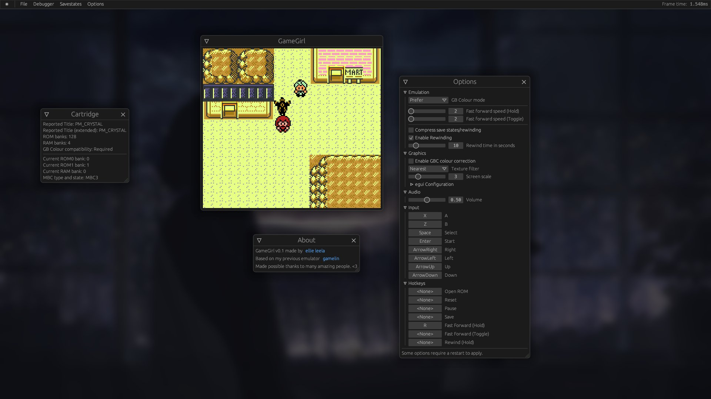
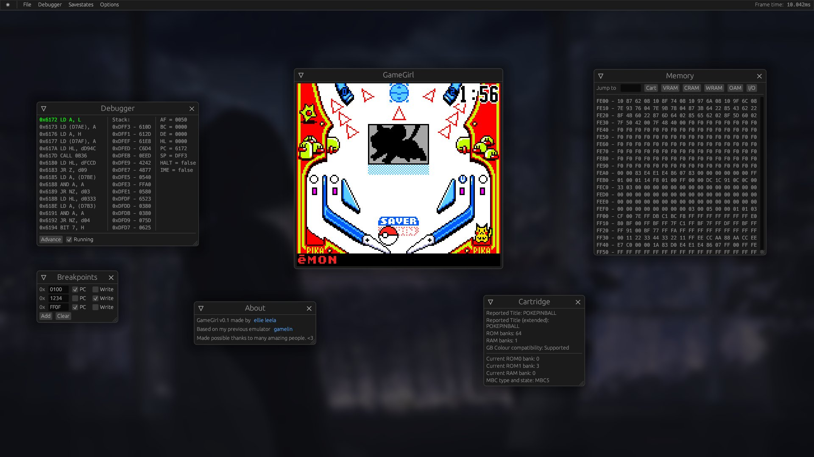
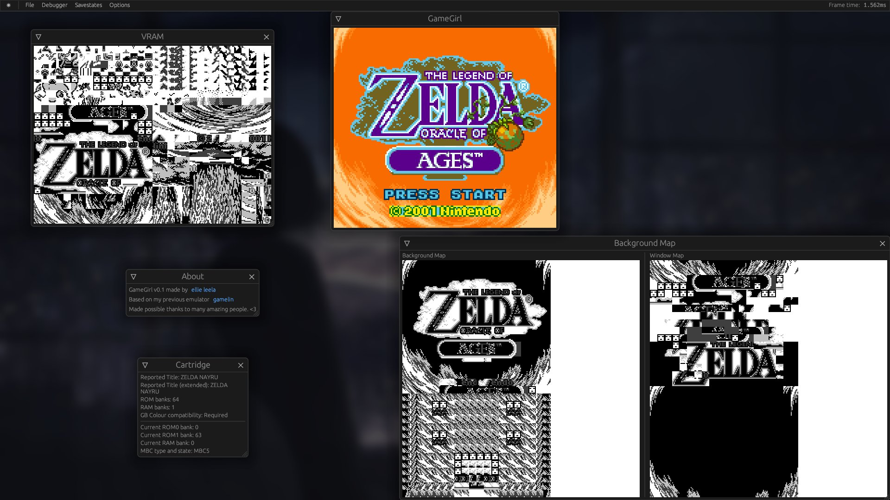

# GameGirl
A Gameboy (Color/Advance) emulator written in Rust, whose GG/GGC core is a rewrite of 
[gamelin](https://git.angm.xyz/ellie/gamelin).  
[Try it in your browser!](https://gamegirl.angm.xyz)


## Status
The DMG/CGB emulator is in a good and usable state. Both DMG and CGB emulation is complete and quite accurate, 
enough to make most commercial games run perfectly.  
AGB support is very very early with nothing really working yet; still working on implementing the CPU.

### Features
- Complete DMG/CGB implementation, including running DMG games on CGB
- Colour correction for CGB
- Highly configurable, including input
- Savegame support in common `.sav` format (Basic RTC support)
- Support for creating and loading save states with "undo last load" function
- Fast forwarding hotkeys, both toggle and hold
- Rewinding support with little memory use (~1MB per second of rewinding at 60fps)
- Debugger with:
    - Line-by-line advance
    - PC and write breakpoints
    - Memory, register and stack view
    - Cartridge Info Viewer
    - Visual debugging tools: VRAM and map viewers
- Automated running of blargg and mooneye tests

### Planned Features
- [ ] Controller support
- [ ] Save export on Web/WASM
- [ ] Fix savestates/rewinding on WASM
- [ ] Proper GBA support, someday?


## Screenshots
##### Playing Pokemon Crystal Clear

##### Pokemon Pinball with running debugger and memory viewer

##### TLoZ: Oracle of Ages with some visual debugging tools open



## Goals
The main goals of this emulator is to create a nice-to-use emulator with many comfort features that should be able
to run well in the browser. Accuracy is only a goal when it fixes issues encountered
by actual games; implementing complex but ultimately useless hardware details that aren't used by (almost any) games
(like the OAM bug or MBC1 multicarts) is not a goal of this emulator.

### Missing console features
- Some MBC3 controllers have a built-in RTC for keeping track of time; gamegirl implements it,
  but in a very simple format incompatible with other emulators that has a high chance of
  not working with most games (it was tested with Pokemon Crystal and successfully kept time
  after turning the game off overnight - needs more testing).
  It is the same format used by Gamelin.


## Build
``` bash
cargo build --release
# Release binary now in target/release/gamegirl_bin.
```


## Testing
Blargg and mooneye ROMs can be run automatically:
```bash
# Release recommended for speed
cargo run -p tests --release
```

### Blargg test results
All tests except for `oam_bug` (which will not be implemented) pass.

### Mooneye test results
- `acceptance`: 30 out of 71 pass
- `emulator-only`: All pass (except MBC1 multicart; will not be supported)

### Acid2
mattcurrie's dmg-acid2 and cgb-acid2 are both correct, including CGB compatibility mode on dmg-acid2.


## Thanks To
### General
- [emilk, for creating egui](https://github.com/emilk/egui)
- The wider Rust community, for its awesome ecosystem
- You, for reading this :)

### GG/GGC
- [Imran Nazar, for their series of blog posts on GB emulation](http://imrannazar.com/GameBoy-Emulation-in-JavaScript:-The-CPU)
- [Michael Steil, for The Ultimate Game Boy Talk](https://media.ccc.de/v/33c3-8029-the_ultimate_game_boy_talk)
- [kotcrab, for creating the xgbc emulator I often used to confirm/understand fine behavior](https://github.com/kotcrab/xgbc)
- [Amjad50, for their emulator mizu, which I abridged the sound implementation from](https://github.com/Amjad50/mizu/)
- [Megan Sullivan, for her list of GB opcodes](https://meganesulli.com/blog/game-boy-opcodes)
- [gbdev.io for a list of useful resources and the Pan Docs](https://gbdev.io)
- blargg, Gekkio and mattcurie for their test ROMs and retrio for hosting blargg's ROMs

### GGA
- [GBATEK, as a technical reference](https://problemkaputt.de/gbatek.htm)
- [mj-hd, for rgba, which I used to properly understand ARM7 emulation details](https://github.com/mj-hd/rgba/)
